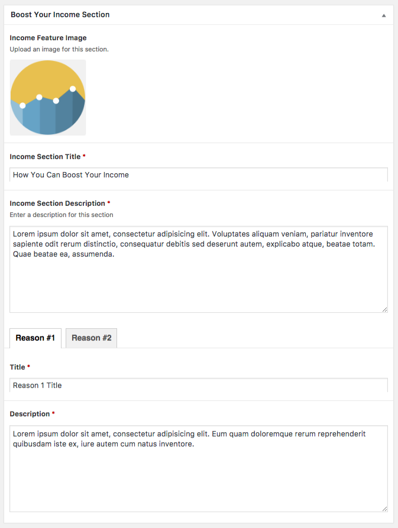
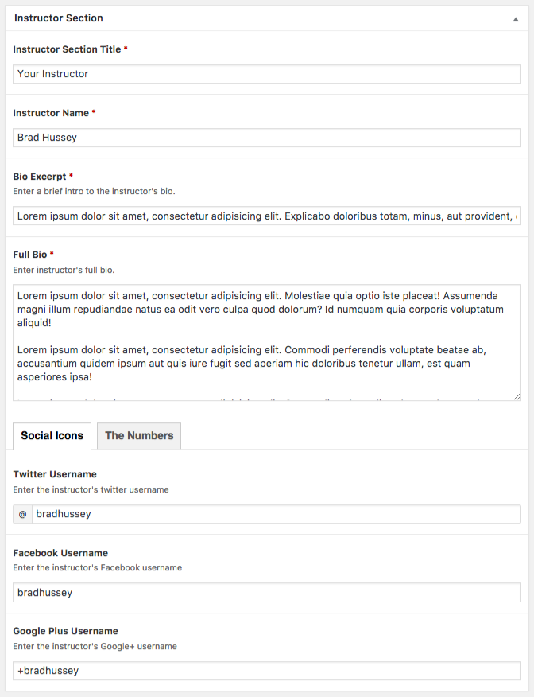

#bootstrap2wordpress

A WordPress theme made for an online course, [WordPress Theme Development with Bootstrap](https://www.udemy.com/bootstrap-to-wordpress).

Certificate of completion: https://www.udemy.com/certificate/UC-L9WGVDZB/

[Demo](https://wp.lanihuang.com/b2w)

##Theme Features
- Responsive design using Bootstrap
- Home page template consists of different template parts that can be easily reordered, modified or removed.
- Use custom post type to conveniently modify dynamic informations like course features, project features, testimonials and resources
- When editing a page, use custom fields provided to modify dynamic information of the template

## How to Install
1. Download all files as a `.zip` file
2. Upload and install it in your WordPress dashboard.

## Home Page

  <p>The home page is styled as a landing page with different sections showing off a product. Header and footer have beautiful parallax effects.</p>

  

  <h2>Easy to Update</h2>
  <p>Each page is dynamically coded with PHP and HTML so that text, images, icons can be easily updated in the admin area. Custom fields are created for each section of the home page and are nicely grouped together using Advanced Custom Fields.</p>

Edit screen of the home page with all sections of custom fields folded up:


Custom fields of Boost Your Income Section:



  <p>Here's the dynamic template for Boost Your Income section using custom fields.</p>
```php
<?php
$income_feature_image       = get_field( 'income_feature_image' );
$income_section_title       = get_field( 'income_section_title' );
$income_section_description = get_field( 'income_section_description' );
$reason_1_title             = get_field( 'reason_1_title' );
$reason_1_description       = get_field( 'reason_1_description' );
$reason_2_title             = get_field( 'reason_2_title' );
$reason_2_description       = get_field( 'reason_2_description' );
 ?>

 <!-- BOOST YOUR INCOME
================================================ -->
<section id="boost-income">
  <div class="container">
    <div class="section-header">
      <!-- If user uploaded an image -->
      <?php if( !empty($income_feature_image) ) : ?>
        " alt="<?php echo $income_feature_image['alt']; ?>">
      <?php endif; ?>
      <h3><?php echo $income_section_title; ?></h3>
    </div><!-- section-header -->

    <p class="lead"><?php echo $income_section_description; ?></p>

    <div class="row">
      <div class="col-sm-6">
        <h3><?php echo $reason_1_title; ?></h3>
        <p><?php echo $reason_1_description; ?></p>
      </div><!-- col-sm-6 -->

      <div class="col-sm-6">
        <h3><?php echo $reason_2_title; ?></h3>
        <p><?php echo $reason_2_description; ?></p>
      </div><!-- .col-sm-6 -->
    </div><!-- .row -->
  </div><!-- .container -->
</section>
```

Custom fields of Instructor Section:




  <p>Custom post types like course features, project features, testimonials and resources are added to the admin area using Custom Post Type UI. Hence, the user can easily access and edit these items from the left sidebar of the admin area.</p>

Admin area sidebar showing custom post types:


Edit screen of a course feature:


  <p>Here's how to print out all course features in a loop:</p>
```php
<?php $loop = new WP_Query( array( 'post_type'  => 'course_feature', 'orderby' => 'post-id', 'order' => 'ASC') ); ?>

<?php while( $loop->have_posts() ) : $loop->the_post(); ?>

  <div class="col-sm-2">
    <i class="<?php the_field('course_feature_icon'); ?>"></i>
    <h4><?php the_title(); ?></h4>
  </div><!-- col -->

<?php endwhile; wp_reset_query(); ?>
```


Edit screen of a project feature:


  <h2>Resources Page</h2>
  <p>The Resource page shows dynamic resources which can be added easily via admin area &rarr; Resources.</p>

A screenshot of 3 resources:


  <h2>Blog Page</h2>
  <p>The blog page's post excerpt is customized with the following style.</p>

A blog post excerpt:


  <p>There are also a few customized sidebar widgets.</p>

Some customized widgets:


  <h2>Contact Page</h2>
  <p>The contact page consists of a simple contact form that is made using Contact Form 7.</p>

The contact form on the contact page:


Code of the contact form:


<h2>Development Environment</h2>
  <p>The theme is developed locally by setting up a localhost with MAMP for easier development, then the local site's database is imported to the online site via phpMyAdmin. However, the local site’s database consists of more than 100 occurrence of the localhost’s address. The online site won’t work until all of those occurrence are changed to the online address. This can be easily done with the help of Search Replace DB, a php plugin that quickly modifies a string throughout a database.</p>

<h3>Tools</h3>

  <ul>
    <li><a href="//underscores.me" target="_blank">Underscores</a> is a WordPress starter theme.</li>
    <li><a href="//wordpress.org/plugins/advanced-custom-fields/" target="_blank">Advance Custom Fields</a> customise WordPress with powerful, professional and intuitive fields.</li>
    <li><a href="//wordpress.org/plugins/custom-post-type-ui/" target="_blank">Custom Post Type UI</a> is an admin UI for creating custom post types and custom taxonomies in WordPress.</li>
    <li><a href="//wordpress.org/plugins/contact-form-7/">Contact Form 7</a> is a contact form plugin for WordPress</li>
    <li><a href="//github.com/interconnectit/Search-Replace-DB" target="_blank">Search Replace DB</a> quickly modifies a string throughout a database.</li>
    <li><a href="//www.phpmyadmin.net/" target="_blank">phpMyAdmin</a> handles the administration of MySQL over the WWW.</li>
    <li><a href="//www.mamp.info/" target="_blank">MAMP</a> is a solution stack used to run dynamic websites on Mac.</li>
  </ul>
